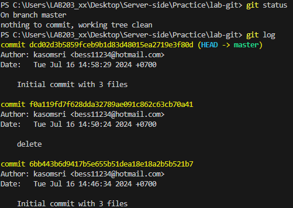

Creating a lab scenario that involves using `git add`, `git commit`, and `git status` to monitor changes over three steps with three files.


### Step 1: Initial Setup and First Commit

1. **Create Lab Directory and Initialize Git Repository**
   - Create a new directory for the lab and navigate into it:
     ```bash
     mkdir git-lab
     cd git-lab
     ```
   - Initialize a new Git repository:
     ```bash
     git init
     ```


2. **Create Three Files and Check Status**
   - Create the initial files:
     ```bash
     echo "Content for file 1" > file1.txt
     echo "Content for file 2" > file2.txt
     echo "Content for file 3" > file3.txt
     ```
   - Use `git status` to see the untracked files:
     ```bash
     git status
     ```


3. **Add Files to Staging and Commit**
   - Add the files to staging:
     ```bash
     git add file1.txt file2.txt file3.txt
     ```
   - Commit the changes:
     ```bash
     git commit -m "Initial commit with three files"
     ```
   - Verify the commit:
     ```bash
     git status
     git log
     ```

### Step 2: Modify Files and Second Commit

1. **Modify Files**
   - Make changes to the files:
     ```bash
     echo "Additional content for file 1" >> file1.txt
     echo "Additional content for file 2" >> file2.txt
     ```

2. **Monitor Changes and Commit**
   - Check the status to see the modified files:
     ```bash
     git status
     ```
   - Stage the modified files and commit:
     ```bash
     git add file1.txt file2.txt
     git commit -m "Updated file1 and file2"
     ```
   - Verify the changes:
     ```bash
     git status
     git log
     ```


### Step 3: Final Modifications and Commit

1. **Final Modifications**
   - Modify the third file:
     ```bash
     echo "Additional content for file 3" >> file3.txt
     ```

2. **Final Commit**
   - Use `git status` to check the changes:
     ```bash
     git status
     ```
   - Stage and commit the final change:
     ```bash
     git add file3.txt
     git commit -m "Final update to file3"
     ```
   - Verify the final commit:
     ```bash
     git status
     git log
     ```


### Conclusion

Through these steps, you've created a lab environment that demonstrates the basic workflow of Git, including monitoring file changes with `git status`, staging changes with `git add`, and committing changes with `git commit`.