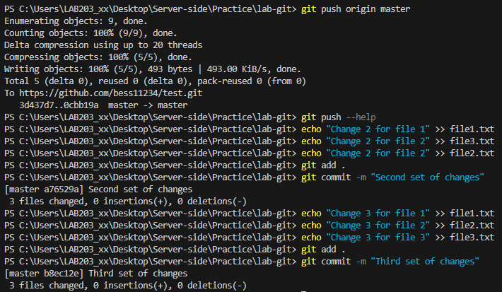

To create a lab environment with Git, push three files to a remote repository, and make changes to these files three times, 


1. **Initialize a Local Git Repository**:
   Create a new directory for your lab, or use an existing directory. Initialize it as a Git repository.
   ```bash
   mkdir lab-git
   cd lab-git
   git init
   ```

2. **Create Your Initial Files**:
   Create three initial files in the directory.
   ```bash
   echo "Initial content for file 1" > file1.txt
   echo "Initial content for file 2" > file2.txt
   echo "Initial content for file 3" > file3.txt
   ```

3. **First Commit**:
   Add these files to the staging area and commit them.
   ```bash
   git add file1.txt file2.txt file3.txt
   git commit -m "Initial commit with three files"
   ```

4. **Create a Remote Repository**:
   Create a new repository on a platform like GitHub, GitLab, or Bitbucket.

5. **Link Your Local Repository to the Remote**:
   Replace `REMOTE-URL` with the URL of your new remote repository.
   ```bash
   git remote add origin REMOTE-URL
   ```

6. **Push to the Remote Repository**:
   Push your changes.
   ```bash
   git push -u origin master
   ```
   

7. **Make and Commit Changes Three Times**:
   
   For each round of changes, modify the files, add the changes to staging, and commit. Here's an example for the first round:
   ```bash
   echo "Change 1 for file 1" >> file1.txt
   echo "Change 1 for file 2" >> file2.txt
   echo "Change 1 for file 3" >> file3.txt
   git add file1.txt file2.txt file3.txt
   git commit -m "First set of changes"
   ```

   Repeat the above step two more times with different change messages (e.g., "Second set of changes", "Third set of changes") and push after each commit:
   ```bash
   git push origin master
   ```

This workflow demonstrates a typical use case in Git for version control and tracking changes over time. 

