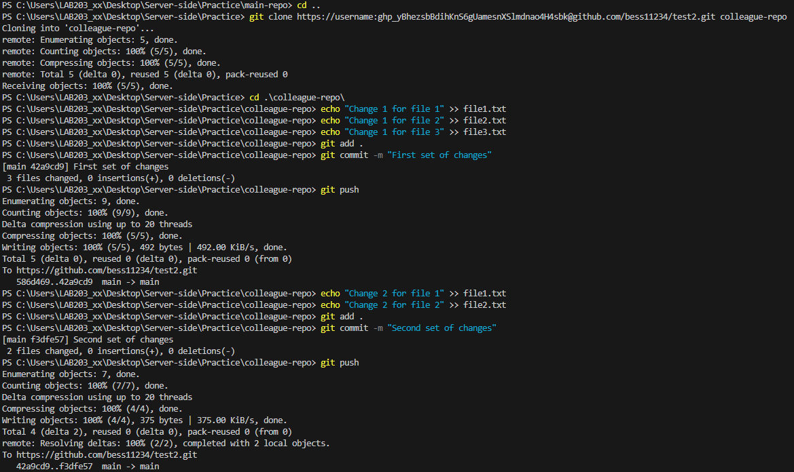

To demonstrate a scenario with Git involving fetching from a remote repository and viewing the commit log, especially after making changes three times to three files, you'll follow a structured process. 


### Initial Setup in the Main Repository

1. **Create and Initialize the Repository**:
   ```bash
   mkdir main-repo
   cd main-repo
   git init
   ```

2. **Create Initial Files and Commit**:
   ```bash
   echo "Initial content for file 1" > file1.txt
   echo "Initial content for file 2" > file2.txt
   echo "Initial content for file 3" > file3.txt
   git add .
   git commit -m "Initial commit with three files"
   ```

3. **Create a Remote Repository**:
   - Create a new repository on a platform like GitHub, GitLab, or Bitbucket.

4. **Add Remote and Push**:
   ```bash
   git branch -M main
   git remote add origin [REMOTE-URL]
   git push -u origin main
   ```

### Making Changes in a Separate Clone (Simulating Another Team Member)

1. **Clone the Repository**:
   ```bash
   git clone [REMOTE-URL] colleague-repo
   cd colleague-repo
   ```

2. **Make Changes Three Times and Push**:
   Each time, edit the files, commit the changes, and push to the remote repository.
   ```bash
   # First round of changes
   echo "Change 1 for file 1" >> file1.txt
   echo "Change 1 for file 2" >> file2.txt
   echo "Change 1 for file 3" >> file3.txt
   git add .
   git commit -m "First set of changes"
   git push

   # Second round of changes
   echo "Change 2 for file 1" >> file1.txt
   echo "Change 2 for file 2" >> file2.txt
   git add .
   git commit -m "Second set of changes"
   git push

   ```



### Fetching and Viewing Log in the Main Repository

Now, back in the main repository, you would fetch the changes and view the log:

1. **Fetch Changes**:
   - This will update your local repository with data from the remote repository.
   ```bash
   cd ../main-repo
   git fetch
   ```

2. **Viewing the Git Log**:
   - The `git log` command shows the commit history.
   ```bash
   git log
   ```

   - For a more compact view, you can use:
   ```bash
   git log --oneline
   ```

   - To see the log of all branches, not just the current one:
   ```bash
   git log --all --oneline
   ```

3. **merge the Changes:
   - Incorporate  changes into your local branch.
```
git merge origin/main
```


This process illustrates how changes made by different team members (or in different clones of the repository) can be incorporated and reviewed in a collaborative workflow. The `git fetch` command updates your local repository with the latest commits from the remote, and `git log` provides a historical record of the changes, aiding in tracking and understanding the evolution of the project. 