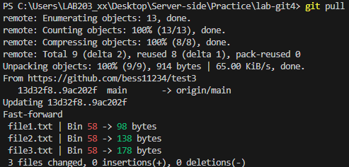
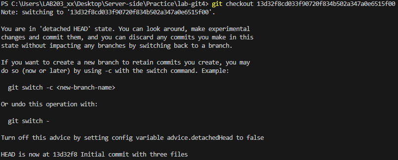

Creating a comprehensive lab exercise that involves `git pull`, `git status`, `git log`, and `git checkout`, with a focus on managing three files and applying three rounds of changes, provides a practical understanding of key Git operations. This exercise is tailored to simulate a collaborative coding workflow using Git.

### Objective:
To gain hands-on experience and understanding of `git pull`, `git status`, `git log`, and `git checkout` in a collaborative project environment, focusing on version control and managing changes in a shared repository.

### Prerequisites:
- Basic knowledge of Git commands.
- Git installed on your machine.
- Access to a GitHub, GitLab, or Bitbucket account to create and use a remote repository.

### Part 1: Setup and Initial Commit

#### Task 1: Initialize Local Repository
1. Create a new directory, initialize it as a Git repository, and create three files.
   ```bash
   mkdir lab-git
   cd lab-git
   git init
   touch file1.txt file2.txt file3.txt
   ```

2. Add initial content to the files and commit them.
   ```bash
   echo "Initial content for file 1" > file1.txt
   echo "Initial content for file 2" > file2.txt
   echo "Initial content for file 3" > file3.txt
   git add .
   git commit -m "Initial commit with three files"
   ```

#### Task 2: Create Remote Repository
1. Create a new repository on a platform like GitHub, GitLab, or Bitbucket.
2. Link your local repository to the remote and push your changes.
   ```bash
   git branch -M main
   git remote add origin [REMOTE-URL]
   git push -u origin main
   ```


### Part 2: Making Changes in a Cloned Repository

#### Task 3: Clone and Modify
1. Clone the repository into a different location to simulate another collaborator.
   ```bash
   git clone [REMOTE-URL] colleague-repo
   cd colleague-repo
   ```

2. Make three sets of changes, committing and pushing each set.
   ```bash
   # Example for the first round of changes
   echo "Change 1 in file 1" >> file1.txt
   git add file1.txt
   git commit -m "First change to file 1"
   git push

   # Repeat for the second of changes
   echo "Change 2 in file 1" >> file1.txt
   git add file1.txt
   git commit -m "Second change to file 1"
   git push
   ```

### Part 3: Pulling, Status Checking, Logging, and Checking Out

#### Task 4: Pull Changes and Check Status
1. In the original repository (`lab-git`), pull the updates from the remote.
   ```bash
   git pull
   ```



2. Check the status to see the current state of your local repository.
   ```bash
   git status
   ```


#### Task 5: Review Commit History
1. Use `git log` to view the commit history.
   ```bash
   git log --oneline
   ```


#### Task 6: Explore Specific Commits
1. Use `git checkout` to explore specific commits (optional, if exploration is needed).
   ```bash
   git checkout [COMMIT-HASH]
   # Return to the latest state
   git checkout master
   ```
กลับไปยัง Commit แรก



กลับมา Commit ล่าสุด


#### COMMIT-HASH


### Deliverables:
1. **Step-by-Step Report**: Document each step, including the commands used and their outputs. Screenshots can be included to enhance the report.
2. **Reflective Summary**: Write a reflection on the use of `git pull`, `git status`, `git log`, and `git checkout` in managing and tracking changes in a collaborative project.

### Assessment Criteria:
- Completeness and correctness of the performed steps.
- Clarity and comprehensiveness of the report and summary.
- Demonstrated understanding of the Git commands and their practical application in a collaborative environment.

This lab exercise is an effective way to immerse students in the practical aspects of using Git in a team setting, reinforcing key concepts essential for collaborative software development.