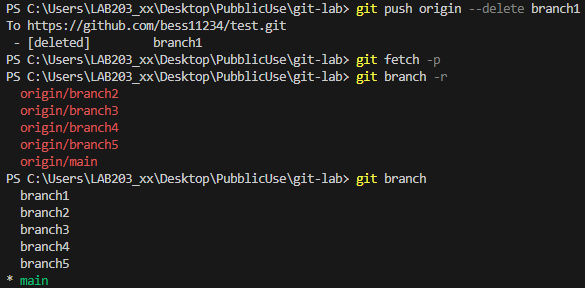

Certainly! Using `echo` to create the content of files directly from the command line can be a practical way to demonstrate the use of Git without needing a text editor. Below is a lab exercise that incorporates the `echo` command:

---

## Git Lab Exercise: Understanding Commits and Branches 

### Objective
Learn the basic Git workflow, including staging changes, making commits, and creating branches, using the `echo` command to add content to files.

### Setup

1. Open the terminal.
2. Choose a directory for your Git project, navigate there using `cd`, and then initialize a new Git repository with:

   ```bash
   git init
   ```

### Task 1: My First Commit 

1. Use `echo` to create a new file called `README.md` with some initial content and stage it for commit:

   ```bash
   echo "# Line 1" > README.md
   echo "# Line 2" >> README.md
   echo "# Line 3" >> README.md
   git add README.md
   ```
   Check status
   ```
   git status
   ```
   
2. Commit your staged change:

   ```bash
   git commit -m "My First Commit"
   ```
    Check status
   ```
   git status
   ```
   

3. git log check Head and history
   ```bash
   git log --all --oneline 
   ```  
4. display current branch
   ```bash
   git branch
   ```
   

### Task 2: Commit "Add Line four" in master and Create and commit  new branch 

1. Create and switch to a new branch named `new_branch`:

   Create a new branch
   ```
   git branch new_branch
   ```
  
   Check the branch we are on
   ```
   git branch
   ``` 


   
   make sure you are in master branch
   ```
   git switch master
   ```
   
   ```bash
   echo "# Line 4 (master)" >> README.md
   git add README.md

   ```
   Commit "Added Line four" in master branch  
   ```
   git commit -m "Added Line four"
   ```
 
   display Readme.md
   ```
   cat README.md
   ```
 


  Switch to the new branch
   ```bash
   git switch new_branch
   ```
   
   Check the branch we are on
   ```
   git branch
   ``` 

   display Readme.md
   ```
   cat README.md
  ```
   
   check Head and history

    
    git log --all --oneline 
   
    

   Commit new branch
   ```bash
   echo "This line is added in the feature branch." >> README.md
   git add README.md
   git commit -m "New branch commit"
   ```
   
   ```bash
   echo "This is my first file in the Git repository." >> README.md
   git add README.md
   git commit -m "New branch commit 2"
   ```

  check Head and history
   ```bash
   git log --all --oneline
   ```    
 

### Task 3: Add Experimental branch and Delete

```
git branch experimental
```

```
git switch experimental
```

check the branch we are on

```
git branch
```


```bash
echo "This is experimental branch" >> README.md
echo "Finall this branch will delete" >> README.md
git add README.md
git commit -m "New branch commit 2"
```

```
git switch master
```

tell me if error
```
git branch -d experimental
```


```
git branch -D experimental
```

