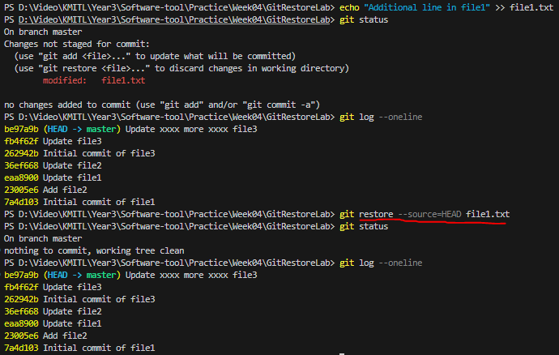
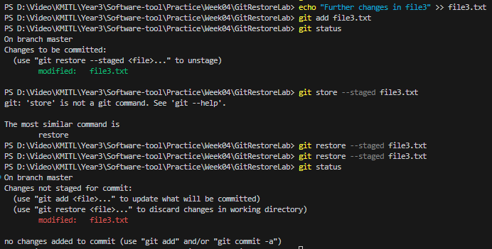

### Git Lab Exercise: Proficiency with `git restore`

#### Objective
Develop a comprehensive understanding of the `git restore` command in Git through a series of hands-on exercises. This lab includes making five distinct commits, followed by operations using `git restore`, and understanding the repository's state with `git log` and `git status`.

#### Setup
1. **Initialize a New Git Repository:**
   Begin by creating a new Git repository in your terminal:

   ```bash
   git init GitRestoreLab
   cd GitRestoreLab
   ```

   ```bash
   git init 
   ```

2. **Create Files and Commit Sequentially:**
   Follow these steps for each of the five commits:

   - **Commit :**
     ```bash
     echo "Initial content in file1" > file1.txt
     git add file1.txt
     git commit -m "Initial commit of file1"
     ```

   - **Commit :**
     ```bash
     echo "Initial content in file2" > file2.txt
     git add file2.txt
     git commit -m "Add file2"
     ```

   - **Commit :**
      ```bash
      echo "Update to file1" >> file1.txt
      git add file1.txt
      git commit -m "Update file1"
      ```
      ```bash
      echo "Update to file2" >> file2.txt
      git add file2.txt
      git commit -m "Update file2"
      ```


   - **Commit :**
      ```bash
      echo "Initial content in file3" > file3.txt
      git add file3.txt
      git commit -m "Initial commit of file3"
      ```
      ```bash
      echo "Update to file3" >> file3.txt
      git add file3.txt
      git commit -m "Update file3"
      ```


   - **Commit :**
      ```bash
      echo "xxxx More xxxx Update to file3" >> file3.txt
      git add file3.txt
      git commit -m "Update xxx More xxx file3"
      ```

   

#### Tasks
1. **Use `git log` and `git status`:**
   After each operation, examine the commit history and current status:

   ```bash
   git log --oneline
   git status
   ```

2. **Practice Using `git restore` with HEAD:**
   Modify a file and revert the changes using `HEAD`:

      ```bash
      echo "Additional line in file1" >> file1.txt
      git status  # Check the effect
      git log --oneline  # Check the effect
      ```
      ```bash
      git restore --source=HEAD file1.txt
      git status  # Check the effect
      git log --oneline  # Check the effect
      ```
      


3. **Restore to Specific Commit and HEAD~3:**
   Alter a file and restore it to an earlier commit:

   ```bash
   echo "More Change in file2" >> file2.txt
   ```

   ** try to change N = 1,2,3..
   ```bash
   git restore --source=HEAD~N file2.txt
   ```


4. **Stage Changes and Explore `git restore --staged`:**
   Stage changes in a file and then unstage them:

   ```bash
   echo "Further changes in file3" >> file3.txt
   git add file3.txt
   git status  # Verify staged
   ```

   ```bash
   git restore --staged file3.txt
   git status  # Verify unstage
   ```

   


#### Deliverables
- A detailed report documenting each step, the `git` commands used, and the outcomes observed.
- Analysis of the role of `git log` and `git status` in managing repository changes.

#### Conclusion
This lab is designed to provide a deep understanding of `git restore`, emphasizing its importance in precise version control and repository management in Git.

