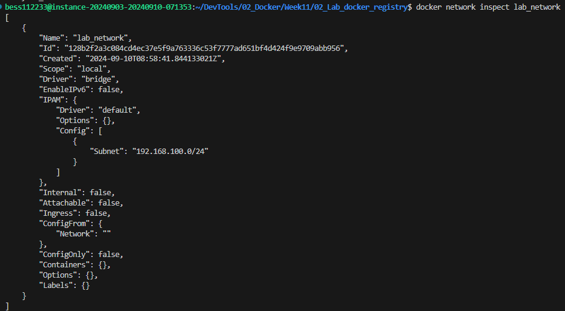
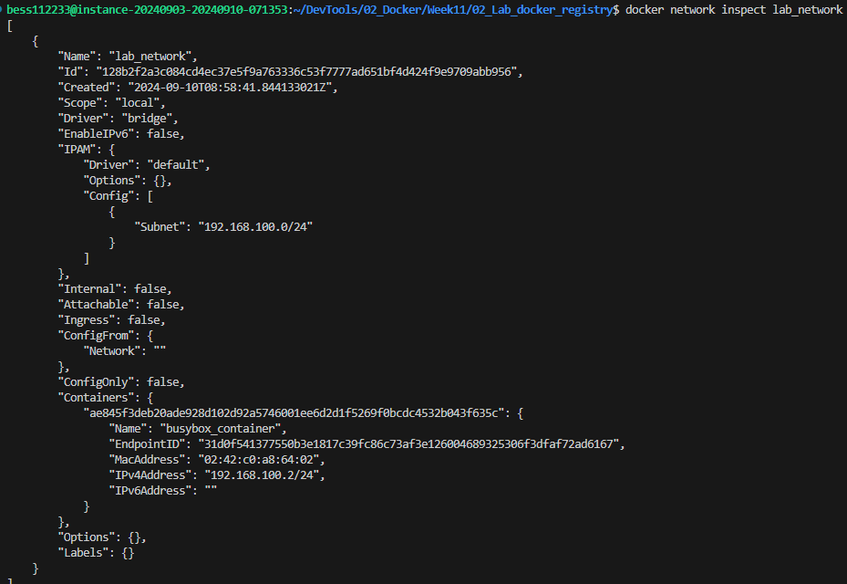

# Lab Docker Network with Subnet 

This guide explains how to create a lab Docker network with a specific subnet using a busybox container.

### 1.  Create a new Docker network named "lab_network" with a specific subnet, e.g., 192.168.100.0/24, using the following command:

Explore  Networks

```
docker network ls
```

```
docker network create --subnet 192.168.100.0/24 lab_network
```

### 2. To confirm that the "lab_network" has been created and to view its settings, run the following command:

```
docker network inspect lab_network
```

###  3. Run a new container with the busybox image and connect it to the "lab_network" using the following command:
```
docker run -d --name busybox_container --network lab_network busybox sleep 360000
```


###  4.  To check the IP address of a running busybox container, follow these steps:
```
docker exec -it busybox_container sh

```

```
ip addr
```


```
exit
```


### 5.  To disconnect the busybox container from the "lab_network", use the following command:


```
docker network disconnect lab_network busybox_container
```

** inspect the network again


```
docker network inspect lab_network
```

** reconnect the container to the network

```
docker network connect lab_network busybox_container
```

** inspect the network again


```
docker network inspect lab_network
```


### 6. To remove the "lab_network" when it's no longer needed, use the following command:

```
docker network disconnect lab_network busybox_container
```


```
docker network rm lab_network
```


# Delete all containers

```
docker stop $(docker ps -a -q)  
docker rm $(docker ps -a -q) 
docker rmi $(docker images -q) 
docker volume rm $(docker volume ls -q)  
docker network prune -f
```