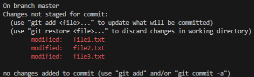
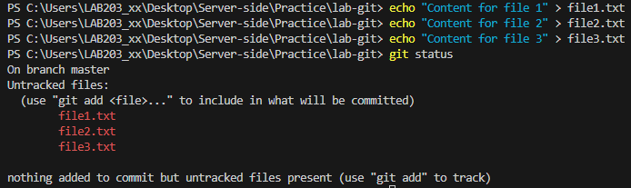
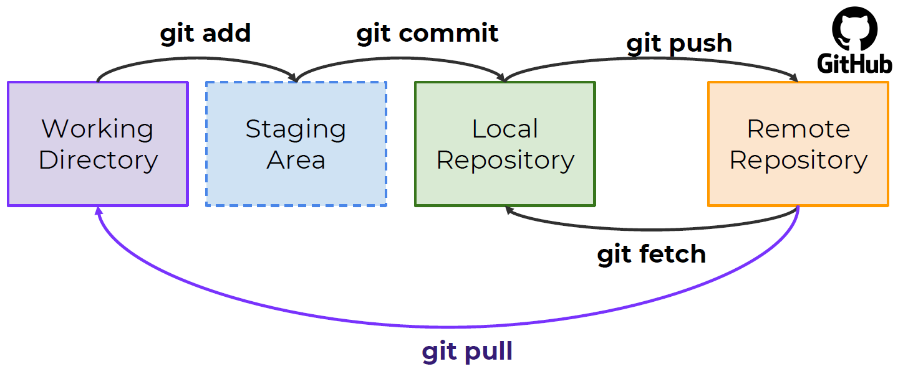

# Week 1 (GITHUB)
เพื่อให้สามารถดูข้อมูลการตั้งค่า git ของเราต้องใช้คำสั่ง
```bash
git config -l
```
เวลาตั้งค่า name กับ email ต้องใช้คำสั่ง
```bash
git config --global user.name "<name>"
git config --global user.email "<email>"
```
หรือต้องการ **Unset** name กับ email ต้องใช้คำสั่ง
```bash
git config --global --unset user.name
git config --global --unset user.email
```
เมื่อใช้มีการเพิ่มไฟล์ (ไม่ใช่อัพเดท) จะทำให้เกิด `Untracked files` หรือแก้ไขไฟล์เข้าไป จะทำให้เกิด `Changes not staged for commit` โดยสามารถใช้คำสั่งต่อไปนี้ เพื่อดูว่ามีไฟล์ใดที่เป็นแบบนั้น
```bash
git status
```




แต่ถ้าขึ้น Error แบบนี้

`fatal: not a git repository (or any of the parent directories): .git`

แปลว่าเราไม่ได้อยู่ใน git repository และการใช้คำสั่งต่อไปนี้ ก็สามารถทำให้ `repository` -> `git/remote repository`
```bash
git init
```

เราสามารถสร้างไฟล์ `.gitignore` เพื่อให้ชื่อไฟล์ที่อยู่ในนี้ ไม่อัพขึ้น git สามารถใช้เว็บ
[gitignore](https://www.toptal.com/developers/gitignore) เพื่อ Generate `.gitignore` ได้

## Exercise
โดยให้เราลองสร้าง **Private repository** ใน Github แล้วนำไป Clone ใส่เครื่อง โดยใช้คำสั่ง
```bash
git clone <URL> <Optional:FolderName>
git clone -b <branch> <URL> # เมื่อสร้างขึ้นมาแล้วจะยัดใส่ branch ที่เรากำหนด
```
***Hint:***
```bash
git clone https://username:<Token>@github.com/username/repo.git <Optional:FolderName>
```
หรือ
```bash
git clone https://username:<Token>@<URL ที่เริ่มที่ github.com> <Optional:FolderName>
```
Token สามารถสร้างได้ที่ Github โดยต้อง
```bash
Settings -> Developer settings -> Personal access tokens -> Token (classic) -> Generate new token -> [repo -> admin:repo_hook] -> Generate token
```

# Week 2
ใช้คำสั่ง git add เพื่อเปลี่ยนสถานะจาก `Untracked files` เป็น `Changes to be committed`

เปลี่ยนจาก state `Working directory` -> `Staging Area`
```bash
git add <all_files>
```
หรือต้องการ Commit ไฟล์ทุกไฟล์
```bash
git add .
```
เมื่อต้องการ Commit ลง github ให้ใช้คำสั่ง

เปลี่ยนจาก state `Staging Area` -> `Local repository`
```bash
git commit -m "Example"
```
`git commit` จะสร้างจุด Checkpoint ทำให้ย้อนเวลาได้

ถ้าต้องการย้าย Branch ไป Branch ที่ต้องการ
```bash
git branch -M <branch>
```
ถ้าต้องการเชื่อม git เข้ากับ git init ต้องใช้คำสั่ง
```python
git remote add origin <REMOTE-URL>
git remote add <name> <REMOTE-URL> # เปลี่ยน Branch นอกจาก origin ได้
```
ุถ้าต้องการเปลี่ยนชื่อ git repository ให้เป็นชื่ออื่นให้ใช้คำสั่ง
```bash
git remote rename <name-origin> <new-name>
```

ถ้าต้องการลบ URL ของ repository นั้น ๆ ให้ใช้คำสั่ง
```bash
git remote remove <name>
git remote remove origin
```

ถ้าต้องการอัพขึ้นไปยัง git ต้องใช้คำสั่ง
ทำให้ข้อมูลใน state `Local repository` -> `Git/Remote repository`
```python
git push -u origin <branch> # -u จะทำให้ track branch ให้สามารถ git pull/git push ได้เลย โดยจะเอาตามที่เคย git push -u ไป
git push origin <branch> # ทำให้ git pull/git push ต้องเลือก branch
```
โดยเมื่อต้องการอัพไฟล์เข้าไปยัง git repository ที่ได้สร้างขึ้นใหม่ใน github ให้ใช้คำสั่งดังนี้
```bash
git branch -M <branch>
git remote add origin <Remote-URL>
git push -u origin <branch>
```
> โดย branch ต้องมีชื่อเดียวกันกับตอน push
```bash
git branch -M test
git push -u origin test
```

เมื่อต้องการดึงข้อมูลจากใน `Git/Remote repository` เพื่อทำการอัพเดทข้อมูลภายใน `Local repository` โดยจะยังไม่ได้อัพเดททันทีแต่จะนำ Commit ล่าสุดเข้ามารอที่เครื่อง ใช้คำสั่ง

`Git/Remote repository` -> `Local repository`
```bash
git fetch
```
เมื่อต้องการให้อัพเดทข้อมูลไปยัง `Working directory` จากที่ได้ดึงข้อมูลมาจากการใช้ `git fetch` ให้ใช้คำสั่ง

`Git/Remote repository` -> `Working directory`
```bash
git merge
git merge origin/main
```
หรือ เมื่อดึงเสร็จเราสามารถอัพเดท `Local repository` ให้ตรงกับ Commit ล่าสุดให้ใช้คำสั่งนี้ หรือจริง ๆ สามารถใช้คำสั่งนี้เพื่อดึงข้อมูล Commit ได้เลยไม่ต้อง `git fetch + git merge`
```bash
git pull
```
เมื่อต้องการดู Commit ที่ได้ทำไปให้ใช้คำสั่ง
```bash
git log
```
เมื่อต้องการย้อนกลับไป ให้ข้อมูลเหมือน git repository ที่ remote อยู่ให้ใช้ หรือไปที่ branch นั้น ๆ สามารถใช้ได้โดย
- ย้อนเวลาผ่าน COMMIT-HASH
- ย้ายไป branch ที่ต้องการ
```python
git checkout <branch>
git checkout origin/main # last commit
git checkout [COMMIT-HASH] # git log --oneline แสดง COMMIT-HASH ที่อยู่บน git/remote repository
```



## Extras
เมื่อต้องการหาความแตกต่างของไฟล์ว่าเราได้แก้อะไรไปบ้าง
โดยคำสั่งนี้หากไม่มีการใช้ Flaged เพิ่มเติมจะหาความแตกต่างระหว่างไฟล์ใน `Working directory` <-> `Staging Area`
```bash
git diff
```

หากต้องการหาความแตกต่างระหว่าง `Staging Area` <-> `Local repository` ให้ใช้
```bash
git diff --staged | --cached
```

หากสิ่งที่เราแก้ไปมีการแก้ Format แล้วเกิด Whitespace แล้วเราไม่ต้องการสนใจมันให้ใช้
```bash
git diff -w
```
# Week 3

วิธีเช็คว่า Git repository มี branch อะไรบ้าง และดูได้ว่าเราอยู่ branch
```bash
git branch
```
และสามารถใช้เพื่อเพิ่ม branch ได้อีกด้วย
```bash
git branch <new_branch>
```
วิธีการเปลี่ยนชื่อ
1. `git branch -m/-M <rename_branch>` จะเปลี่ยนชื่อ branch ที่ HEAD ชี้อยู่
2. `git branch -m/-M <branch> <rename_branch>` จะเปลี่ยนชื่อ branch ที่เรากำหนด

เมื่อต้องการดูว่า `Local repository` เราได้อัพขึ้น branch ไหนใน `Git/Remote repository` ให้ใช้
```bash
git branch -r
```
เมื่อต้องการดู Last commit แต่ละ branch
```bash
git branch -v
```

และเมื่อต้องการเปลี่ยน branch ไปอีกอันให้ใช้ คล้าย `git checkout <branch>`
```bash
git switch <branch>
```

เมื่อต้องการลบ branch ออกให้ใช้
```python
git branch -d <branch> # มีการเตือน หากยังไม่ทำการ Merge เข้ากับตัวหลัก
git branch -D <branch> # ลบทันที
```
> ``🔥`` ไม่สามารถลบ branch ได้หากเราอยู่ใน branch นั้น ๆ

เมื่อต้องการสร้าง branch แล้วเข้าไปยัง branch นั้นทันที
```bash
git checkout -b <new_branch>
```

เมื่อต้องการ merge กับ branch อื่น ๆ ไปยัง branch ของเราให้ใช้
```python
git merge <branch> # อยู่ที่ว่าปัจจุบันเราอยู่ branch อะไร โดยจะ merge เข้ากับ branch ที่ใส่เข้าไป
```

## Extra
หาก pull แล้วเกิด conflict เกิดขึ้น ให้ทำการ merge เมื่อ merge เสร็จแล้วห้ามลืม
```
git commit -m "Merge"
```

หาก merge กับ branch เสร็จแล้วต้องการลบ branch ให้ใช้
```bash
git branch -d/-D <branch>
```
แต่ใน `Git/Remote repository` ยังไม่ได้ลบให้ใช้คำสั่ง
```bash
git push -d/-D <origin> <branch>
```

# Week 4

เมื่อต้องการ Update ไฟล์ทั้งหมดที่ถูกแก้ไข โดยไม่ต้อง `add` และ commit เลยให้ใช้ `-am`

หรือก็คือไฟล์ที่มีสถานะเป็น `Changes not staged for commit`
```bash
git commit -am "<text>"
```
> ``🔥`` ไม่สามารถใช้กับไฟล์ที่เพิ่งสร้างได้

`git commit -a` เป็นการระบุ File ที่ต้องการ Commit

เมื่อต้องการกู้คืนข้อมูลจากการที่เรา Commit ไปแล้วให้ใช้ tree หรือ HEAD คล้ายการทำ Ctrl+Z เลข 0, 1, 2, 3.. คือจำนวนครั้งที่ย้อนไป
- ใช้งานได้จากการที่ยังไม่ Commit เมื่อต้องการรีไฟล์ที่ต้องการ
```python
git restore --source=<HEAD/tree>[~(1,2,3..)] <file, file, ...>
git restore -s <HEAD/tree>[~(1, 2, 3)] <file, file, ...>
git restore -s <HEAD/tree>[~(1, 2, 3)] . # ทุกไฟล์
```

เมื่อเผลอกด commit ไฟล์ หรือไม่ได้ต้องการให้ไฟล์บางไฟล์ commit ให้ใช้ จะเป็นการย้อน staged กลับไปยังก่อน add
- อาจจะใช้ตอนที่ `git add .` แล้วมีไฟล์ที่ไม่ต้องการ commit เลยใช้คำสั่งนี้
```python
git restore --staged <file, file, ...>
git restore -S <file, file, ...>
git restore -S . # ทุกไฟล์
```

เมื่อต้องการรีเซ็ต `soft` กลับไปยัง commit ที่ต้องการ โดยไม่มีผลกระทบต่อเนื้อหาในไฟล์ 
- เมื่อไปดูที่คำสั่ง `git log --oneline` ก็จะกลับไปยัง commit ที่ใส่ HASH เข้าไป
```bash
git reset --soft <COMMIT-HASH>
git reset <COMMIT-HASH>
```
> ``🔥`` ไฟล์ยังสามารถ commit ได้ต่อ เพราะเมื่อย้อนไปเนื้อหาไม่ถูกกระทบ ทำให้ต่างกับใน git repository ไฟล์นั้น ๆ เลยอยู่ใน Stage ที่รอการ commit

เมื่อต้องการรีเซ็ต `hard` กลับไปยัง commit พร้อมกับเนื้อหาไฟล์ของ commit นั้น
```bash
git reset --hard <COMMIT-HASH>
```
> ``🔥`` การย้อนแบบนี้ไม่มีผลต่อไฟล์ที่พึ่งสร้าง และยังไม่ได้ถูก Commit

เมื่อต้องการ revert กลับไปยัง commit ก่อน และแก้ไขข้อมูลในไฟล์เอง เมื่อมีการ revert แล้วจะให้แก้ conflict กับ commit หลังมัน และจะเกิด commit ใหม่ให้มาด้วย
```python
git revert <COMMIT-HASH>
# กดเสร็จจะมีการ conflict ของไฟล์ให้แก้ไข
git add .
git revert --continue # จะมีขึ้น vim แก้ไขชื่อของ Commit :wq | :!q
git log --oneline # จะมีการเพิ่มขึ้นของ Commit
```
# Week 5 (GOOGLE CLOUD)

การสร้าง Key ที่ใช้ในการ Authentication เข้าไปใน Instance ที่มี Public key ของเรา
```bash
mkdir mykey
cd mykey
ssh-keygen -t rsa -b 2048 -C "username" -f  username_gcp_key # Generate RSA KEY
ssh -i ./username_gcp_key username@[EXTERNAL_IP] # ./username_gcp_key เป็น Private key # username@[EXTERNAL_ID username เป็นของ Instance
```

# ข้อสอบกลางภาค
70 ข้อ (35 คะแนน ข้อกา) 2 ข้อ 1 คะแนน
- github 57
- google cloud 3
- docker ออกครึ่งเดียว 10

# Week 6
## Generate RSA Key
```python
ssh-keygen -t rsa -b 2048 -C "username" -f filename_key
```
> ``🔥`` จะได้ไฟล์ .pub ซึ่งเก็บ Public key ไว้ และไฟล์ที่ไม่มีนามสกุลเก็บ Private key

## SSH TO INSTANCE
โดยเราต้องกำหนด `Public key` ให้ Instance รู้ก่อนจึงใช้ `Private key` ของเราเข้าผ่าน ssh ได้
```
ssh -i <PathPrivateKey> <usernameINinstance>@[EXTERNAL_IP]
```

# Week 7
## kill signal
```python
ps -a # ดู Signal
kill -9 <Signal>
```

## Delete all containers
```
docker stop $(docker ps -a -q)  
docker rm $(docker ps -a -q) 
docker rmi $(docker images -q) 
docker volume rm $(docker volume ls -q)  
docker network prune -f
```

## Nginx
```python
docker run nginx # ถ้าไม่มี Nginx จะโหลด และจะสร้าง Container Nginx ขึ้นมา ถ้ามี Nginx จะสร้าง Container อีกตัวขึ้นมา
```

## BusyBox
```python
docker run busybox hi there # เหมือน Nginx
```

## Ubuntu
```python
docker run ubuntu
docker run ubuntu sleep 5
docker run ubuntu sh -c "echo 'Hello' && echo 'World' && echo `pwd`"
```

## Docker
- สามารถกำหนด RAM หรือสเปคที่ให้ Container แต่ละอันใช้ได้

## Docker vs Virtual Machine
- Virtual Machine
    - หนักกว่า (GB)
    - ใช้งานได้เยอะกว่า
    - มีการ Boot up หลายอย่าง
- Docker
    - เบากว่า (MB)
    - ใช้งานได้น้อยกว่า
    - Boot up น้อย

ง่าย ๆ คือ Docker เล็ก เร็ว มีประสิทธิภาพ แต่การใช้งานจำกัด Virtual Machine ตรงกันข้าม

Docker daemon คือตัวจัดการให้ภายในเครื่องเราเมื่อมีการดึงข้อมูลจาก Registry จะดูว่าข้อมูลเราตรงไหม

Dockerfile คือเหมือน Docker Image

## Command
Run container
```bash
docker run nginx
docker run --cidfile <id> <image>
```
Run test
```bash
docker run busybox echo hi there
```
> ``🔥`` busybox เป็น Image ขนาดเล็กที่เหมือน Ubuntu แต่เล็กกว่าไว้ใช้ทดสอบ

Run ubuntu
```python
docker run ubuntu
docker run ubuntu sleep 5 # ให้หลับ 5 วิ
docker run ubuntu sh -c "echo 'Hello' && echo 'World' && ls && pwd && date"
```

## Port Mapping
คือการทำ Port ออกข้างนอก เข้าข้างในได้
```python
docker run -p 80:5000 myname/simple-app # 80 ข้างนอก 5000 ข้างใน โดยคนข้างนอกเข้ามาต้องใช้ Port 80

docker run -p 3306:3306 mysql
# ข้างนอก (ตัวแรก) Port เดียวกันไม่ได้
# ข้างใน (ตัวสอง) Port เดียวกันได้

docker run mysql # ไม่ให้ออกข้างนอก
docker run -d <service> # รัน Service โดยให้เป็น backgroud process
```

## Volumn Mapping
```python
docker run –v /opt/datadir:/var/lib/mysql mysql # : เอาไว้คั่นระหว่างตัวที่จะ Link กัน
docker run -d -p 8083:80 -v ${PWD}/web_demo:/usr/share/nginx/html:ro nginx
```

# Week 8
## Stop Containers
```python
docker ps
docker stop <Names> # Names ของ Container เปลี่ยน Status เป็น Exited (0)
docker stop ($docker ps -aq) # หยุด Containers ทั้งหมด
```

## Remove Containers
```python
docker ps
docker rm <Names> # ลบ Containers
docker rm ($docker ps -aq) # ลบ Containers ทั้งหมด
docker container prune -f # ลบ Containers ที่มี Status Exited (0) หรือก็คือหยุด
```

## Images Container
```python
docker images # ดู Images ทั้งหมดใน Docker
```

## Images Remove
```python
docker rmi <image_repository> # ดู repository ได้จาก `docker images`
docker rmi -f $(docker images -aq) # ลบ Image ทั้งหมด
docker rmi prune -f # ลบ Image ที่ไม่ได้ใช้
```

## Docker command
```python
docker pull <image> # image อย่าง ubuntu
docker build -t <image> <pathtoDockerfile> # สร้าง Images ผ่าน Dockerfile
docker run -it <image> [<command_exec[sh, bash, /bin/bash, zsh, ..]>]
docker run <image> # Create container from images and run on current process
docker run -d <image> # Create container from images and run on backgroud process
docker ps -a # Show containers
docker exec <container_name> <run_command> # อย่าง Container_name นั้นมี Image เป็น Ubuntu; run_command คือคำสั่งที่จะรันใน container นั้น โดย status ต้องเป็น UP
docker inspect <cotainer_name> # ส่อง Container นั้น ๆ ว่ามี IP, Name, State, Path
docker logs <container_name> # ส่อง Container ว่าใช้ Command Line อะไรบ้าง และเกิดผลลัพท์อะไร
```

## Docker set environment variable
ยกตัวอย่าง Python
```py
# app.py
os.environ['APP_COLOR']

# cmd docker
docker run -p 8081:8081 -d --name container_red -e APP_COLOR=red flask-docker-app
```
> ``🔥`` โดยที่ -e จะเป็นการกำหนด Environment variable

## Status codes and HTTP methods
HTTP Methods
- GET   : retrive an existing resource (read only)
- POST  : create a new resource/send information
- PUT   : update an existing resource
- PATCH : partically update an existing resoure
- DELETE: delete a resource

HTTP status code
- 2xx   : successful
- 3xx   : redirect
- 4xx   : client error
- 5xx   : server error

## Dockerfile
```
RUN # ทำคำสั่งหลัง Build
CMD # ทำคำสั่งหลัง Run Build เสร็จ
```

## Tips
```python
เมื่อมีการรันไฟล์ Container ที่ Image มี Dockerfile ควรดู Port ที่เขียนไว้ด้วย เพราะเมื่อทำการ docker run -p <อะไรก็ได้>:<ตาม Dockerfile>
```